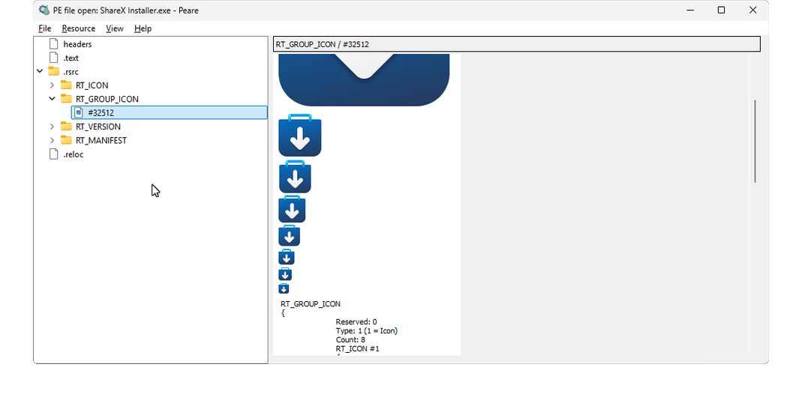

# Peare

*Portable Extractor of Archives, Resources & Executables*

<p align="center">
  
</p>

<p align="center">
  
</p>

Peare is a resource explorer, decoder, and future resource editor for historical executable formats and application packages.

> **AI-authored project — read before relying on it.** Most of Peare is written
> and maintained by AI (large language models), under human direction and review
> rather than line-by-line human authorship. In particular, the entire
> DiscUtils-compatible file-system and virtual-disk stack, and most format
> readers, are clean-room ports produced by AI from reference implementations and
> specifications. Consequences you should assume:
>
> - **Verify before trusting.** Do not rely on Peare for anything critical
>   (forensics, data recovery, integrity verification) without independently
>   checking the output.
> - **"Byte-exact" means "matched the tests we ran"**, not a formal guarantee; many
>   formats were validated against a single sample, and some against none.
> - **Machine-generated bugs may be present** in ways that differ from typical
>   hand-written code.
>
> The human maintainer directs the work, reviews changes, and is responsible for
> the project; the bulk of the authoring is done by AI. Bug reports and fixes are
> welcome.

The project is inspired by **Resource Hacker** and **BCC Workshop**. Its current focus is understanding and preserving resources from classic Windows and OS/2 software, including formats that modern tools often ignore or only partially support.

## Why the name Peare?

**Peare** is an acronym for **Portable Extractor of Archives, Resources & Executables**.

- **Portable** — one lean C++11 core behind a thin C ABI, meant to run on many operating systems (from OS/2 to Android), not tied to any single platform.
- **Extractor** — the first and central job: pull the original bytes out of a container **exactly**, byte-for-byte, whether that container is an executable, an archive, a disc image, or a file system nested inside a virtual disk.
- **Archives, Resources & Executables** — the three families it opens: archives and disk/volume images, the resources inside modules, and the historical executable formats it grew from.

The name also reflects how the project actually grows. Rather than a plugin system, new format support is brought in by porting the reference implementation directly into the core — for example the clean-room C++ port of the DiscUtils file-system and virtual-disk stack. AI-assisted development makes wiring a whole library into the core faster and cleaner than defining and maintaining a plugin boundary, so extensibility lives in the source, not in an external plug-in ABI.

The first **E** stands for **Extractor** today; once in-place editing lands — the long-standing goal inherited from Resource Hacker and BCC Workshop — it becomes **Editor**, and Peare turns into a *Portable Editor of Archives, Resources & Executables* without changing its name.

## Project history

This project was born by the merging of three C# projects I previously made:
- A .fnt viewer (files were extracted from .fon with BCC Workshop) 
- A PE resource reader to read DLL bitmaps.
- A raw bitmap reader.

The initial Peare with viewer capabilities opened Windows NE/PE formats, and was all wrote by hand.

I was slowly integrating other formats and resource support, understanding and learning formats, reading decades old manuals and PDFs.

Then the AI came. Most of the project was still done by hand but with AI support to understand formats structures.

In 2026 the AI development made a great step forward, so I decided to go all-in with it. I was able to refine the format structures faster but then I decided Peare had to get portable.

```System.Drawing```, ```System.Windows.Forms``` and ```DllImport``` were my biggest enemies at this point, so I made the AI port everything to QtWidgets. All what was supported in my handcrafted C# version has been ported to C++ with no compatibility loss found.

This is the current state of this project.

## Project goals

Peare aims to:

- open executable modules and application packages;
- expose their contents as navigable resource trees;
- preserve every original resource payload byte-for-byte;
- decode supported images, text resources, fonts, menus, dialogs, and related formats;
- keep the GUI detached from the backend;
- get one backend to list and expose the contents of a module or package (as an archiver);
- get one backend to read and parse to a more common format all the niche and historical formats inside;
- provide a stable C ABI without exposing Qt or C++ types, so can be used in other projects and languages with a simple wrapper;
- stay extensible by porting new container, file-system, and disk formats directly into the core behind the same C ABI;
- expand beyond currently supported formats to other packages that contain resources worth inspecting.

Possible future package families include JAR, APK, APPX, XAP, MSI, and MSIX. These are project goals, not current compatibility claims.

## Target operating systems

The project is intended to remain portable and run natively on:

- [ ] OS/2;
- [ ] macOS;
- [X] Windows (modern);
- [ ] Windows (XP);
- [X] Linux;
- [X] Android.

## Current architecture

The current implementation is written in C++11 with Qt 5.15 and is divided into three products:

- _Peare_
- _PeareOpener_
- _PeareDecoder_

### Peare

The GUI opens files, builds the resource tree, displays decoded results, composes font glyph maps, exports original payloads and converted output, and provides hexadecimal fallback for unsupported resources.

### PeareOpener

The stateful Opener:

- opens PE, NE, LE, LX, XBE, XEX, XUIZ, LIVE, PIRS, CON executables, OS/2 PACK/PACK2,
  OS/2 FEALIST extended-attribute files and SZDD archives, Siemens firmware, FFU, SDI and XVA deployment images, Linux swap, LVM, MD RAID and Windows Dynamic Disk/LDM, ISO 9660 / WIM / FAT / exFAT / NTFS / ext / XFS / JFS / Btrfs / SquashFS / HFS+ / UDF disc images, and DMG / VMDK / VHD / VDI / VHDX virtual disks —
  from a file path or any byte source, through one entry point;
- opens Microsoft CAB archives, including uncompressed, MSZIP and LZX folders;
- opens ZIP and TAR archives as virtual filesystems;
- opens partitioned raw disk images as disk containers;
- opens a contained file as a nested container on demand, with no image copy;
- lists resource folders and entries;
- preserves numeric and textual identifiers, languages, codepages;
- reconstructs paged, segmented, continued, and large resources;
- returns the original payload and its source context.

It does not decode the resource contents.

### PeareDecoder

The Decoder accepts:

- a payload;
- an optional textual platform such as `Windows` or `OS/2`;
- an optional textual resource type such as `RT_BITMAP` or `RT_FONT`.

It returns simple C ABI outputs:

- arrays of complete PNG files;
- arrays of complete UTF-8 text files;
- typed metadata values;
- rendered font text as PNG.

When context is omitted, the Decoder examines the payload and uses RawDetect where useful.

Platform portability and packaging status is documented in `docs/PORTABILITY.md`.

It does not depend from PeareOpener in any way.

## Supported executable formats

The Opener currently handles:

| Platform | Format | Notes |
|---|---|---|
| Windows | NE | 16-bit |
| OS/2 | NE | 16-bit |
| Windows | PE | 32-bit and 64-bit |
| OS/2 | LE | 16-bit and 32-bit |
| OS/2 | LX | 32-bit |
| Xbox | XBE |  |
| Xbox 360 | XEX |  |

## Supported archives and filesystems

The Opener additionally has support for uncommon archives:

| Format | Description | Notes |
|---|---|---|
| Xbox 360 XUIZ | Resource archive |  |
| OS/2 UnPack | IBM/Microsoft OS/2 PACK and PACK2 archives | PACK v1 LZW and PACK2 FTCOMP `fT19`; member paths are exposed without an artificial archive-root folder |
| OS/2 FEALIST | Extended-attribute list, commonly stored as `.EA_` | Exposes named EAs as binary or text resources; embedded image payloads remain available to the Decoder |
| Microsoft Compress | SZDD archive (variant A) |  |
| Microsoft Cabinet | CAB archive | uncompressed, MSZIP and LZX folders |
| ZIP | Virtual filesystem archive | stored, Shrink and Deflate entries; decompression is lazy; ZIP64/encrypted entries not yet |
| TAR | Virtual filesystem archive | regular files and directories; hard links when target appears first; symlinks skipped |
| Microsoft FFU | Full Flash Update image | Windows Phone/W10M and desktop v1/v2 stores; sparse write descriptors, GPT partitions and multi-store images |
| Microsoft SDI | System Deployment Image | exposes sections such as PART and WIM as nested payloads |
| Xen XVA | Xen Virtual Appliance | TAR-based appliance; reconstructs VDI chunk disks and exposes partitions |
| Siemens ProSave IMG | Firmware image for HMIs |  |
| Siemens ProSave FWF | Firmware image for HMIs | OMS object stream; exposes NK, flash images and nested FSF volumes |
| Siemens FSF | Windows CE flash-file archive used in Siemens HMI firmware | Real `\flash` hierarchy, lazy member extraction and safe partial-segment handling |
| Windows CE ROM / IMGFS | ROM and flash filesystem archive | B000FF, raw NB0/XIP, NOSAJ, ARNOLDBOOTBLOCK, iPAQ NBF, CE 1.x/2.x structural ROMs, IMGFS direct and FTL |
| ISO 9660 | Optical disc image | Joliet; 2048-byte ISO and raw 2352-byte Mode2 BIN images |
| Microsoft WIM | Windows Imaging Format | LZX and XPRESS chunks |
| FAT | FAT12/16/32 volume | Floppies, EFI System Partitions, USB/firmware images |
| exFAT | Microsoft exFAT volume | SD cards, large USB media; contiguous and FAT-chained files |
| NTFS | Microsoft NTFS volume | MFT + attributes, data-run runlists, $I30 index; LZNT1-compressed files not yet decoded |
| ext2/3/4 | Linux ext volume | ext4 extent trees + ext2/3 indirect block maps |
| XFS | Linux XFS volume | v4/v5, local/extent/btree inodes, shortform/block/leaf directories |
| JFS | IBM Journaled File System volume | JFS1 v1/v2, primary/secondary superblocks and AITs, fileset inode maps/IAGs, indexed and legacy OS/2 directory trees, xtree extents, sparse files, symlinks and OS/2 LVM/DriveLink segmented-volume reconstruction |
| HPFS | IBM/Microsoft High Performance File System volume | OS/2 HPFS boot/super/spare blocks, directory dnode B-trees, fnode/anode allocation trees, fragmented and sparse files, hotfix remapping, CP437/850/852/866 names; EAs and HPFS386 ACLs are not exposed |
| Btrfs | Linux Btrfs volume | single-device chunk map, directories, subvolumes, sparse/raw/zlib/LZO extents |
| SquashFS | Compressed Linux filesystem image | v4 zlib, metadata/data blocks and fragments |
| HFS+ / HFSX | Apple HFS Plus volume | Catalog B-tree leaf records and data fork reads through initial extents |
| UDF | Universal Disk Format | OSTA UDF; Type 1 partitions; 2048-byte ISO and raw 2352-byte Mode2 BIN images (metadata/sparable/virtual not yet) |
| Linux swap | Swap volume | v1/v2 magic, version, label and page counts |
| Linux LVM2 | Logical volume manager | single-PV readable striped/linear logical volumes |
| Linux MD RAID | Software RAID member | RAID1 readable volume; v0.90 and v1.0/1.1/1.2 superblock locations |
| Windows Dynamic Disk | Logical Disk Manager | concatenated and striped LDM volumes over the available disk image; multi-disk groups not yet |
| Windows Registry hive | Registry hive file | read-only key navigation and value payloads (`regf`/`hbin`, `nk`/`vk`, `lf`/`lh`/`li`/`ri`) |
| Windows BCD | Boot Configuration Data store | semantic view over Registry-backed `Objects/{GUID}/Description` and `Elements/{ID}` |

## Supported virtual disks

The Opener also reads virtual hard-disk containers. A disk is exposed as its
partition table (MBR, incl. extended, GPT, and Apple Partition Map); each partition is a nested
container that opens the file system inside it (FAT, exFAT, ...) through the same
lazy path.

| Format | Description | Notes |
|---|---|---|
| VMware VMDK | Virtual disk | monolithicSparse, split sparse/flat (including non-zero FLAT backing offsets), streamOptimized |
| Apple DMG / UDIF | Disk image | blkx resources with raw, zero and zlib-compressed runs |
| Microsoft VHD | Virtual disk | fixed and dynamic; differencing parents not yet resolved |
| VirtualBox VDI | Virtual disk | fixed and dynamic; differencing/undo parents not yet resolved |
| Microsoft VHDX | Virtual disk | fixed and dynamic; differencing parents and dirty-log replay not yet resolved |
| RAW | Raw disk image | MBR/GPT/APM partition table over `.img`/similar flat images |

The filesystem readers (ISO 9660, WIM, FAT, exFAT, NTFS, ext2/3/4, XFS, Btrfs, SquashFS, HFS+, UDF), the OpticalDisk Mode2 sector view, the RAW/VMDK/VHD/VDI/VHDX disk readers, the Linux MD RAID1 reader, the Windows LDM reader, the
MBR/GPT/APM partition layer, and the underlying positioned byte-store / stream layer
are clean-room C++ ports of **LTRData DiscUtils**, kept byte-compatible with it.
They compose lazily so a file inside a partition inside a virtual disk opens
without materialising anything.

The JFS and HPFS readers are independent read-only implementations based on
IBM OS/2 and Linux on-disk structures. The JFS reader handles both directory-entry
layouts encountered in OS/2 and indexed JFS volumes, selects usable primary or
secondary metadata, and can reconstruct segmented OS/2 LVM/DriveLink volumes.
They use the same lazy byte-store and nested-container model as the other
filesystem readers.

## Resource compatibility

The matrix below preserves the compatibility declarations of the verified C# implementation on which the current port is based.

Legend:

- **Yes** — implemented;
- **No** — Not yet implemented;
- **N/A** — not known to exist
- **(1)** — known limitations or resources that may not decode correctly;
- **(2)** — implementation exists, but no suitable sample was available for verification;
- **(3)** — known incompatibility with Windows 1.x or 2.x resources.

| Resource | NE OS/2 | LX OS/2 | LE OS/2 | NE Windows | PE Windows |
|---|---:|---:|---:|---:|---:|
| `RT_POINTER` | Yes | Yes | Yes | N/A | N/A |
| `RT_MESSAGE` | Yes | Yes | Yes | N/A | N/A |
| `RT_MESSAGETABLE` | N/A | N/A | N/A | Yes (1)(3) | Yes |
| `RT_BITMAP` | Yes | Yes | Yes | Yes | Yes |
| `RT_STRING` | Yes | Yes | Yes | Yes (3) | Yes |
| `RT_DISPLAYINFO` | Yes | Yes | Yes | N/A | N/A |
| `RT_MENU` | Yes | Yes | Yes | Yes (3) | Yes |
| `RT_ACCELTABLE` | Yes | Yes | Yes | N/A | N/A |
| `RT_ACCELERATOR` | N/A | N/A | N/A | Yes | Yes |
| `RT_DLGINCLUDE` | Yes | Yes | Yes | — | — |
| `RT_HELPTABLE` | Yes (2) | Yes | Yes | — | — |
| `RT_HELPSUBTABLE` | Yes (2) | Yes | Yes | — | — |
| `RT_FONT` | Yes | Yes | Yes | Yes | Yes |
| `RT_FONTDIR` | Yes (1) | Yes (1) | Yes (1) | Yes (1) | Yes (1) |
| `RT_DIALOG` | Yes (1) | Yes (1) | Yes (1) | No | No |
| `RT_NAMETABLE` | — | — | — | Yes (3) | — |
| `RT_GROUP_ICON` | — | — | — | Yes | Yes |
| `RT_ICON` | — | — | — | Yes | Yes |
| `RT_VERSION` | — | — | — | Yes | Yes |
| `RT_GROUP_CURSOR` | — | — | — | Yes | Yes |
| `RT_CURSOR` | — | — | — | Yes | Yes |

OS/2 pointer and bitmap resources may contain `BA`, `BM`, `IC`, `CI`, `CP`, or `PT` structures and may produce multiple images.

The current C++ port continues to evolve. A format marked **Yes** can still contain undocumented or vendor-specific variants.

## Font compatibility

Font support as it is made now has yet to find a problematic sample that doesn't open correctly.

| Font format | Current declared support |
|---|---|
| Windows FNT version 1 | fixed-width raster, variable-width raster, vector |
| Windows FNT version 2 | fixed-width raster, variable-width raster |
| Windows FNT version 3 | fixed-width raster |
| OS/2 FNT | fixed-width raster, variable-width raster, GPI outline |

For a recognized font, the GUI obtains the character range and metrics through `peare_get_info()`, renders the sample sentence at 1x, 2x, 3x, and 4x through `peare_font_render()`, renders every character through the same function, and composes the glyph map locally.

## Raw payload detection

PeareDecoder can be used directly on a payload without first opening a PE, NE, LE, or LX container.

Examples include standalone OS/2 bitmap files and Windows or OS/2 FNT files. The optional platform and resource-type strings improve routing when the caller already knows the origin. When they are omitted, the Decoder examines the data structure and uses RawDetect as a fallback.

If no decoder succeeds, the caller still retains the original bytes. In the GUI, the application-level fallback is a hexadecimal dump.

## Public API documentation

The README intentionally does not duplicate individual function signatures. The complete ABI reference is kept in the dedicated documents so that declarations, ownership rules, status semantics, examples, and export lists remain in one place.

- [Common ABI types and memory ownership](docs/API_TYPES.md)
- [PeareOpener C API](docs/API_OPENER.md)
- [PeareDecoder C API](docs/API_DECODER.md)
- [Architecture and component responsibilities](docs/ARCHITECTURE.md)
- [Developer guide](docs/DEVELOPMENT.md)

The public headers are installed under `include/peare`.

## GUI usage

The basic workflow is:

1. open a supported executable module;
2. select a resource folder and entry from the tree;
3. inspect decoded images, text, metadata, font previews, or hexadecimal fallback;
4. export the original payload or converted PNG/TXT output.

The original payload is always obtained from the Opener and remains available even when decoding fails.

Detailed instructions are in [docs/GUI.md](docs/GUI.md).

## Building

Automated scripts for building are available for each plaform supported.

Manual build and installation procedures are documented in [docs/BUILDING.md](docs/BUILDING.md).

## Extensibility

Peare is extended by **porting new format support directly into the core**, not
through an external plugin ABI. A new container, file system, or virtual disk is
added as a module behind the same common `peare_opener_*` interface — the way the
DiscUtils file-system and virtual-disk stack was brought in as a clean-room C++
port. AI-assisted development makes wiring a whole reference implementation into
the core faster and more maintainable than defining, versioning, and policing a
plugin boundary, so the project's extensibility lives in the source itself.

Adding a module is documented as a checklist in
[docs/ADDING_OPENER.md](docs/ADDING_OPENER.md). Whatever is added must preserve
two invariants: **byte-perfect extraction** of original payloads, and the
**stability of the public C ABI**.

Natural directions from here include exposing .NET resources inside PE files and
opening further package formats (JAR, APK, APPX, MSI/MSIX).

## Roadmap

These are planned directions, not current compatibility claims. Items are grouped
by family; each is a candidate for a byte-exact reader behind the same C ABI.

**File systems**


- **Legacy NTFS** — the early NTFS v1.x layout as written by Windows NT 3.1/3.5,
  which predates several structures the modern reader assumes.

**Archives and compressors (the formats 7-Zip handles, that Peare does not yet)**

- Archivers: **7z**, **RAR**, **LZH/LHA**, **ARJ**, **AR**, **CPIO**, **XAR**.
- Compressors/streams: **GZIP**, **BZIP2**, **XZ / LZMA / LZMA2**, **Zstandard**,
  **Z** (compress).
- Installers and packages: **MSI** (OLE / compound file), **NSIS**, **RPM**,
  **DEB**, **CHM**, **CramFS**.
- Disk/image extras 7-Zip exposes: **QCOW2**, **APFS**, Apple Partition Map.

Where 7-Zip and Peare already overlap (ZIP, TAR, CAB, ISO, UDF, FAT, exFAT, NTFS,
ext, HFS+, SquashFS, WIM, MBR/GPT, VHD/VHDX/VDI/VMDK/DMG) the work is done.

**Variants of formats already supported**

- **SZDD variant B** and the **KWAJ** container — the remaining Microsoft Compress
  formats, alongside the current SZDD variant A.

**Refinements inside existing readers**

- NTFS: **LZNT1** decompression and `$ATTRIBUTE_LIST`-split attributes.
- UDF: metadata / sparable / virtual partition maps (rewritable and Blu-ray media).
- Additional file-system compression codecs (e.g. Btrfs zstd, XFS/SquashFS xz/lzo).

**In-place editing**

- The long-standing goal from Resource Hacker / BCC Workshop: write resources back
  into a module while preserving everything else. When it lands, the acronym's
  first **E** turns from *Extractor* into *Editor*.

Out of scope, by design: DiscUtils' network transports (iSCSI, NFS), OS mount
bridges (Dokan/FUSE), and physical-device access — none of which are "open a
file" operations.

## Project status

Peare is under active development and is not presented as production-stable software.

Historical executable formats contain undocumented structures, vendor variations, malformed resources, and platform-specific assumptions. Compatibility work therefore prioritizes:

- preservation of original bytes;
- explicit failures instead of fabricated output;
- testable ABI boundaries;
- gradual expansion based on real samples.

## Credits

**Third-party code**

| Project | Author |
| --- | --- |
| Qt | The Qt Company |
| DiscUtils (filesystem/disk readers: ISO 9660, WIM, FAT, exFAT, NTFS, ext2/3/4, XFS, Btrfs, SquashFS, HFS+, UDF, Linux swap, LVM2, Linux MD RAID1, Windows LDM, Windows Registry hive and BCD BootConfig stores, DMG/UDIF, VMDK, VHD, VDI, VHDX, SDI, XVA, MBR/GPT/APM, stream/buffer layers) | Kenneth Bell / LTRData |
| wimlib (LZX compression) | Eric Biggers |
| cabextract (LZX code lineage, via wimlib) | Stuart Caie |
| miniz (deflate/zlib decompression) | Rich Geldreich et al. |
| Tiny AES in C | kokke |
| wmp-wsz-format (WMP skin WSZ layout) | Ted de Baets (tdebaets) |
| CERF (Windows CE ROM/container and IMGFS parser reference) | Yaroslav Kibysh / gweslab |
| Linux JFS on-disk format definitions (format reference only) | IBM and Linux JFS maintainers |
| wince-decompr (Windows CE LZX stream framing reference) | KodaSec / Artificial |
| WPInternals | ReneLergner, gus33000, WPInternals contributors |

**Documentation and format references**

| Source | Where |
| --- | --- |
| DiscUtils (LTRData fork) | https://github.com/LTRData/DiscUtils |
| OSTA Universal Disk Format specification | https://www.osta.org/specs/ |
| ECMA-119 (ISO 9660) / ECMA-167 (UDF volume structure) | https://ecma-international.org/publications-and-standards/standards/ |
| FFU Full Flash Update image | https://github.com/ReneLergner/WPinternals |
| wimlib | https://wimlib.net/ · https://github.com/ebiggers/wimlib |
| miniz | https://github.com/richgel999/miniz |
| Tiny AES in C | https://github.com/kokke/tiny-AES-c |
| WMP WSZ format | https://github.com/tdebaets/wmp-wsz-format |
| CERF Windows CE emulator and ROM parser | https://github.com/gweslab/cerf |
| WinCE Decompressor | https://github.com/KodaSec/wince-decompr |
| IBM OS/2 16/32-bit Object Module Format | https://www.edm2.com/index.php/IBM_OS/2_16/32-bit_Object_Module_Format_ |
| Resources and Decompiling Them | https://www.edm2.com/index.php/Resources_and_Decompiling_Them |
| IBM OS/2 2.0 Technical Library (Presentation Driver Reference) | https://bitsavers.trailing-edge.com/pdf/ibm/pc/os2/ |
| Windows 1.03 / 2.0 SDK Programmer's Reference | https://www.os2museum.com/ |
| BetaArchive format discussion | https://www.betaarchive.com/forum/viewtopic.php?t=33486 |

## Copyright

All format specifications, product names, and trademarks referenced or supported
by Peare are the property of their respective owners. Peare provides independent,
clean-room readers and is not affiliated with, authorized by, or endorsed by any
of them. Owners referenced include, among others:

- **Microsoft Corporation** — Windows, MS-DOS, PE / NE / LE / LX consumers,
  NTFS, exFAT, FAT, WIM, FFU, Microsoft Cabinet (CAB), Microsoft Compress (SZDD),
  VHD and VHDX, the Windows registry hive, Boot Configuration Data (BCD),
  System Deployment Image (SDI), and Xbox / Xbox 360 formats (XBE, XEX, XUIZ,
  STFS: CON / LIVE / PIRS).
- **IBM Corporation** — OS/2, the OS/2 PACK / UnPack format, HPFS, and JFS.
- **Apple Inc.** — HFS+ / HFSX and the Apple Disk Image (DMG / UDIF) format.
- **VMware, Inc.** — the Virtual Machine Disk (VMDK) format.
- **Oracle Corporation** — the VirtualBox Virtual Disk Image (VDI) format.
- **Citrix Systems / the Xen Project** — the Xen Virtual Appliance (XVA) format.
- **Siemens AG** — the ProSave IMG, FWF, and embedded FSF firmware formats.
- **OSTA, Ecma International, and ISO/IEC** — UDF and ISO 9660
  (ECMA-119 / ECMA-167).
- **PKWARE, Inc.** — the ZIP format.
- The **Linux kernel community and other open-source authors** — ext2/3/4,
  XFS (originally SGI), Btrfs, SquashFS, LVM2, Linux MD / RAID, the swap format,
  and TAR.

Trademarks are used only to identify the formats Peare reads; such use does not
imply any endorsement.

## Documentation index

- [GUI usage](docs/GUI.md)
- [Architecture](docs/ARCHITECTURE.md)
- [Building and installation](docs/BUILDING.md)
- [Common ABI types](docs/API_TYPES.md)
- [PeareOpener API](docs/API_OPENER.md)
- [PeareDecoder API](docs/API_DECODER.md)
- [Developer guide](docs/DEVELOPMENT.md)


