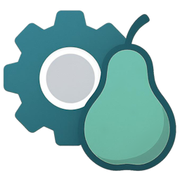
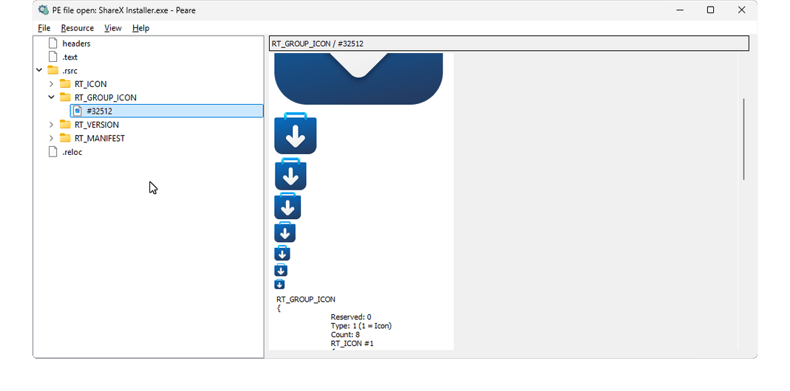

# Peare

**Portable Extractor of Archives, Resources, and Executables**

  

  

  
  
  

Peare opens executable files, archives, packages, file systems, and disk images.
It shows their contents in a resource tree and decodes supported payloads.
PeareWriter can create or update ZIP and TAR archives, FAT, exFAT, NTFS, and
Ext2/3/4 file systems, and supported VHD, VHDX, and VMDK images. It exposes
generic create, replace, rename, and delete operations for writable targets.
Support and limits depend on the format variant and platform.

> **Development status:** Peare is under active development. Format and sample
> coverage vary. Do not use Peare alone for forensic work, data recovery, or
> integrity checks. See the [project scope](docs/about/PROJECT_SCOPE.md).

## Supported formats

The [format matrix](docs/SUPPORTED_FORMATS.md) lists supported variants and
marks read and write support as `Yes` or `No`. The matrix does not claim that
every variant is production-ready.

## Use Peare from an AI chat

Download the ready-to-run Peare MCP package for your client. It includes the
server, Peare libraries, and their runtime.

| Client | Download |
| --- | --- |
| Claude Desktop on Windows x64 | [Installable extension (.mcpb)](https://github.com/RaulMerelli/Peare/releases/download/ci-latest/peare-mcp-windows-x64.mcpb) |
| Codex or Claude Code on Windows x64 | [Windows ZIP](https://github.com/RaulMerelli/Peare/releases/download/ci-latest/peare-mcp-windows-x64.zip) |
| Codex or Claude Code on Linux x64 | [Linux archive](https://github.com/RaulMerelli/Peare/releases/download/ci-latest/peare-mcp-linux-x64.tar.gz) |

Install it once with the [client setup instructions](docs/agents/AI_AGENT_USAGE.md).
Then open a chat and ask for a file operation in plain language.

> Open `C:\VMs\guest.vmdk`. Delete `leggimi.txt` from the default Windows
> user's Desktop and give me the updated disk.

Peare can find the entry, select its volume, and return a verified copy.
The available operations depend on the file format and variant.

## Build and use

- [Build instructions](docs/development/BUILDING.md)
- [Run Peare](docs/user/RUNNING.md)
- [GUI guide](docs/user/GUI.md)
- [AI agent use](docs/agents/AI_AGENT_USAGE.md)
- [Test guide](docs/testing/TESTING.md)
- [Platform status](docs/platform/PORTABILITY.md)

## Technical documentation

- [C ABI references](docs/ABI/README.md)
- [Architecture](docs/architecture/ARCHITECTURE.md)
- [Developer guide](docs/development/DEVELOPMENT.md)
- [Add an Opener module](docs/development/ADDING_OPENER.md)
- [Resource compatibility](docs/formats/RESOURCE_COMPATIBILITY.md)
- [Raw payload decoding](docs/formats/RAW_PAYLOAD.md)
- [Desired targets](docs/NEXT_TARGETS.md)
- [Project origin](docs/about/ORIGIN.md)
- [Roadmap](docs/about/ROADMAP.md)

## License and notices

Peare uses the GNU Affero General Public License, version 3. See [LICENSE](LICENSE),
[copyright and trademark notices](COPYRIGHT.md), and [third-party notices](THIRDPARTY.md).
